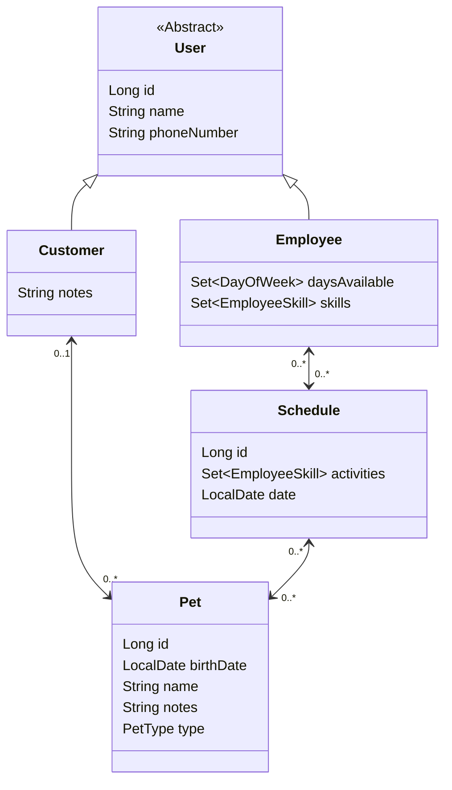

## **專案介紹**

Critter Chronologer 是一個為小型動物提供預約照顧服務的軟體即服務 (SaaS) 應用程式。  
這個 Spring Boot 專案允許用戶建立寵物、飼主和員工的資料，並安排員工為寵物提供互動照顧。

*(圖片來自 [Udacity Java Web Developer](https://www.udacity.com/course/java-developer-nanodegree--nd035) 課程)*

*"Is it time for my appointment yet?"*

## Starter Code

已包含了 Feature tests，同學需要完成主要任務，並通過這些測試!  
可以在 [這裡](https://github.com/udacity/nd035-c3-data-stores-and-persistence-project-starter) 下載 Starter Code。

## **主要任務**

1. **配置設定**
   
    在 Starter Code 專案中，**`application.properties`** 為空白文件。  
    提供適當的 URL 和憑證設定，配置外部資料庫 MySQL 8.0 作為主要資料來源。  
    設置資料庫初始化模式 **`initialization-mode`** 和 **`ddl-auto`**。
   
3. **配置單元測試**
   
    在 **`test/resources`** 目錄中建立一個新的 **`application.properties`** 文件，並將其配置為使用 H2 記憶體資料庫進行單元測試。  
    Starter Code 專案已包含一組功能測試，來幫助確保 RESTful API 能夠滿足需求。  
   
5. **設計和實現數據模型**
   
    設計並實現表示以下數據的模型：

    - 寵物 (Pet)
    - 主人 (Customer)
    - 員工 (Employee)
    - 行程表 (Schedule)
    
    定義每個模型，並建立適當的 Relationships（例如: 一個主人有多個寵物，一個員工有多個空閒時段，並在 MySQL 8.0 建立這些模型的資料表。
    
7. **任務 4：實現 API**
   
    實現以下 API endpoints:
   
    - 建立與管理主人、寵物、員工的資料
    - 預約功能，允許員工根據時間段安排照顧寵物
    
    這些 API 應符合 RESTful 設計原則，並且能夠在 Postman Collection 讓 Reviewer 測試，檔案路徑 `/src/main/resources/Udacity.postman_collection.json`。
    
9. **通過所有單元測試**
    
    確保所有原始碼中的單元測試都能通過，包括但不限於 :
    
    - testCreateCustomer
    - testCreateEmployee
    - testAddPetsToCustomer
    - testFindPetsByOwner
    - testFindOwnerByPet
    - testChangeEmployeeAvailability
    - testFindEmployeesByServiceAndTime
    - testSchedulePetsForServiceWithEmployee
    - testFindScheduleByEntities

## **專案結構**

1. Application 主程式: `CritterApplication.**java**`
    1. Domain Packages: 分為員工、主人、寵物分為三個 Packages
        1. 每個 Package 都是採用 Controller - Service - Data Access Layer 多層架構，每一層有其對應的職責
        2. Controller
            1. 負責 HTTP 請求及回應
            2. 負責 Entity  與 DTO 之間的轉換
            3. DTO 只存在 Controller Layer，不參與其他層級，以維護每一層的關注點 
        3. Service
            1. 負責處理所有商業邏輯
            2. 接收來自 Controller 傳入的參數
            3. 向 Repository 取得資料
        4. Data Access Layer (`repositories`)
            1. 資料保存與提取都在這層完成
            2. 使用 Spring Data JPA 實現
            3. 使用 Hibernate，啟動 Application 時自動產生 SQL Schema
            4. 資料保存在 MySQL 8.0 Database
    2. Test (JUnit)
        1. Controller feature tests
        2. 獨立的 in-memory database (H2)
     

#### Entity Relationships

*User - Employee - Customer 採用 `Joined` Entity Inheritance Strategy*

*Entity 物件穿梭於 Contoller - Service - Repository*

*(圖片來自 [Udacity Java Web Developer](https://www.udacity.com/course/java-developer-nanodegree--nd035) 課程)*

#### Task Breakdown

